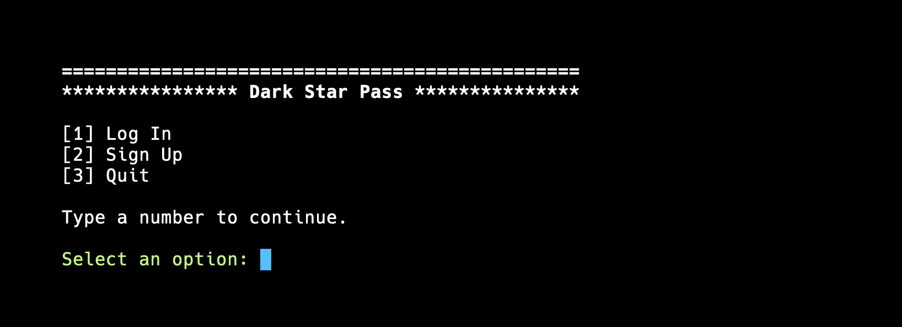
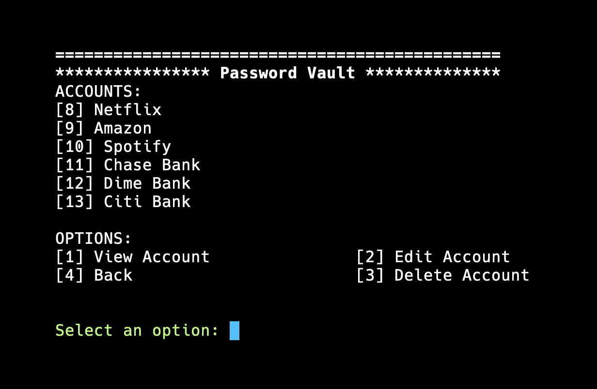
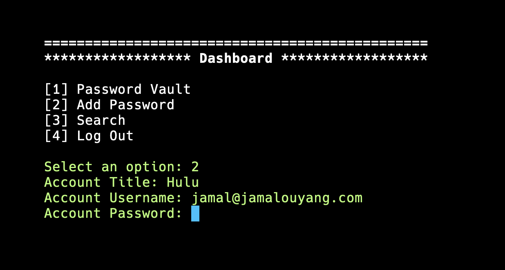
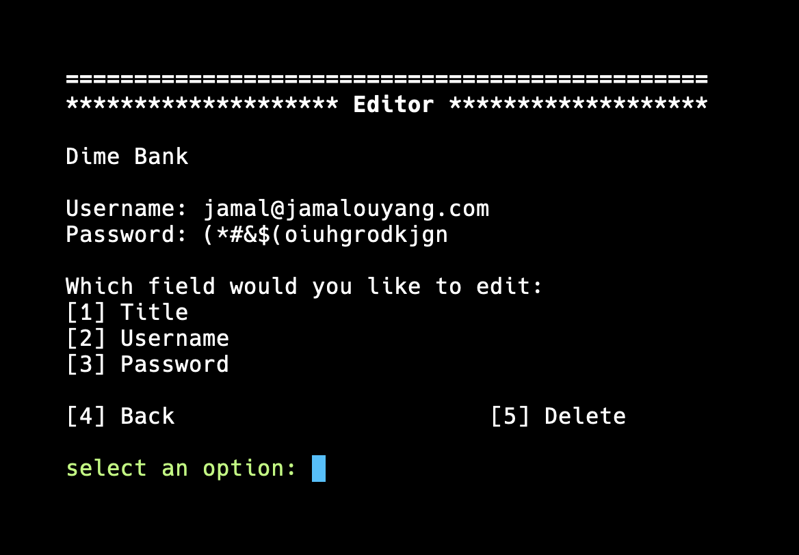
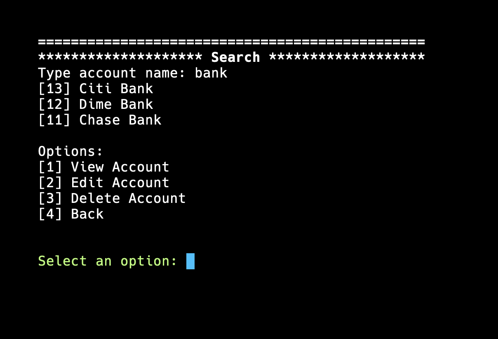
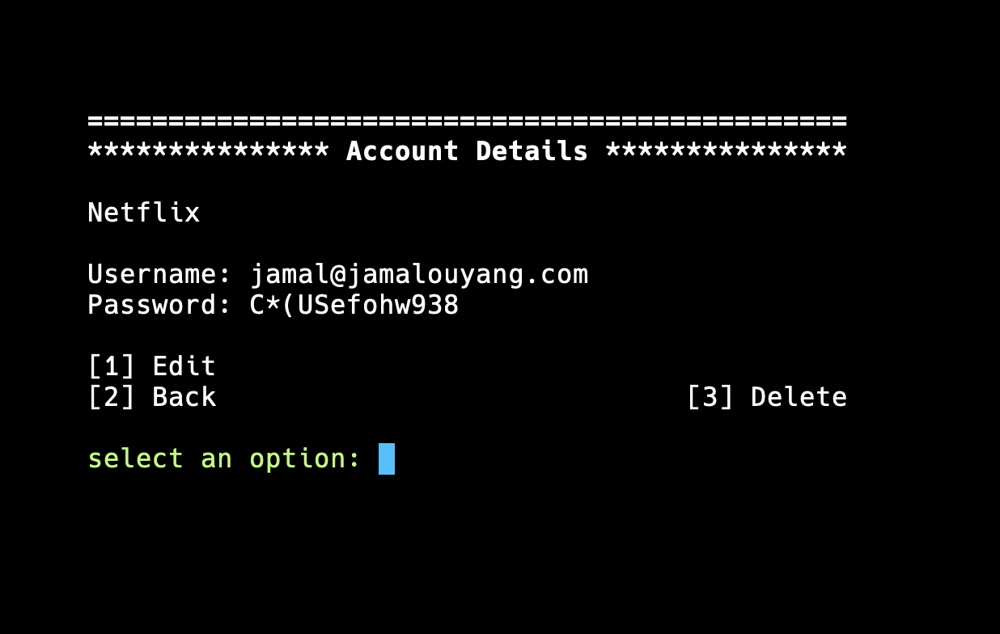
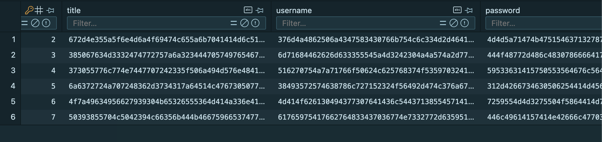
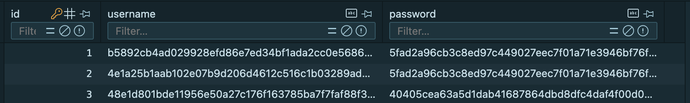

# Dark Star Pass

Dark Star Pass is a secure password management system developed as a Phase 3 project for the Flatiron School Full Stack Software Engineering program. This command-line application allows users to store, retrieve, and manage their passwords securely.

## Features

- User authentication (sign up and log in)
- Secure password storage using encryption
- Add, view, edit, and delete password entries
- Search functionality for stored passwords
- User-friendly command-line interface with color-coded output

## Technologies Used

- Python
- SQLite3
- Cryptography library for encryption
- Colorama for colored terminal output

## Installation

1. Clone this repository
2. Install the required dependencies:
   ```
   pip install -r requirements.txt
   ```
3. Run the application:
   ```
   python lib/cli.py
   ```

## Usage

Upon running the application, you'll be presented with a main menu where you can:

1. Log In
2. Sign Up
3. Quit

After logging in or signing up, you'll have access to the following features:

1. Password Vault: View all your stored passwords
2. Add Password: Add a new password entry
3. Search: Find specific password entries
4. Log Out: Return to the main menu

## File Structure

- `lib/cli.py`: Main application file containing the user interface and program logic
- `lib/db/init.py`: Database initialization
- `lib/db/user.py`: User model and database operations
- `lib/db/password.py`: Password model and database operations
- `lib/db/encryption.py`: Encryption and decryption functions
- `lib/db/seed.py`: Database seeding for testing purposes
- `lib/debug.py`: Debugging utilities

## Security

Passwords are encrypted using the Fernet symmetric encryption scheme from the cryptography library. The master password is used to derive an encryption key, ensuring that even if the database is compromised, the stored passwords remain secure.

## Contributing

This project is part of an educational program and is not actively maintained. However, if you'd like to suggest improvements or report issues, please feel free to open an issue or submit a pull request.

## License

This project is open source and available under the [MIT License](LICENSE).

## Screenshots

Here are some screenshots of the Dark Star Pass application in action:

| Feature        | Screenshot                          |
| -------------- | ----------------------------------- |
| Main Menu      |        |
| Password Vault |  |
| Add Password   |      |
| Edit Password  |    |
| Search         |         |
| View Entry     |           |
| Encryption     |        |
| Hashing        |          |

These screenshots provide a visual overview of the key features and user interface of Dark Star Pass.
